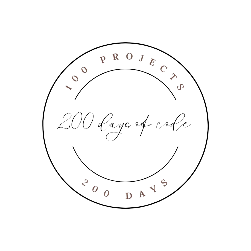

<a name="readme-top"></a>

<!--
*** Thank you for checking out and/or using this README Template. If you have a suggestion
*** that would make this better, please fork the repo and create a pull request
*** or simply open an issue with the tag "improvement".
*** Adapt appropriately and replace all placeholder text with accurate information relating to your project.
*** Do not forget to take the asset folder along with the README.md file so that the icons link will not be broken.
*** Remove all *N/B* comments.
*** Don't forget to give the project a star!
-->

<!-- PROJECT LOGO (N/B: Replace logo url and image to match your project)-->
<br />
<div align="center">
  <a href="https://github.com/scientistigwe/README-Template">
    
  </a>
</div>
  <h1 align="center">Tasktopia: Build your dream day, one task at a time.</h1>

  <p align="center">
    A README template that can be adapted to suite your projects!
    <br>
    (Replace with a short intro sentence about your project).
    <br />
    <br />
    <a href="https://github.com/path-to-readme-file"><strong>Explore the docs »</strong></a>
    <br />
    <br />

<!-- TABLE OF CONTENTS -->

Table of Contents

<!-- INTRODUCTION SECTION -->

  <details>
  <summary><a href="#introduction">SECTION 1: INTRODUCTION</a></summary>
        <li><a href="#about-the-project">About The Project</a>
        <li><a href='#ux'>User Experience (UX)</a></li>
        <li><a href='#user-stories'>User Stories</a></li>
        <li><a href="#technology-stack">Technology Stack</a></li>
        <li><a href="#languages-frameworks-libraries">Languages, Frameworks and Libraries</a></li>
        <li><a href="#management-and-development">Project Management and Development Approach</a></li>
    </details>
    <!-- PROJECT SETUP SECTION -->
    <details>
    <summary><a href="#project-setup">SECTION 2: PROJECT SETUP</a>
</summary>
        <li><a href="#prerequisites">Prerequisites</a></li>
        <li><a href="#installation">Installation</a></li>
    </details>
    <details>
    <summary><a href="#features-and-structure">SECTION 3: PROJECT FEATURES AND STRUCTURE</summary>
    <li><a href="#features">Features</a></li>
        <li><a href="#structure-and-navigation">Structure and Navigation</a></li>
        <li><a href="#wireframes">Wireframes</a></li>
         <li><a href="#design-and-styling">Design and Styling</a>
        <ol>
            <li><a href="#design">Design</a></li>
            <li><a href="#color">Color</a></li>
            <li><a href="#font">font</a></li>
            <li><a href="#media">media</a></li>
        </ol>
        </li>
</details>
<details>
<summary><a href="#testing-and-validation">SECTION 4: TESTING AND VALIDATION</a>
</summary>
    <li><a href="#testing">Testing</a></li>
        <li><a href="#validation">Validation</a>
        <ol>
        <li><a href="#html-validator-report">HTML Validator Report</a></li>
        <li><a href="#css-validator-report">CSS Validator Report</a></li>
        </ol>
        </li>
        <li><a href="#user-story-testing">User Story Testing</a></li>
        <li><a href="#bugs-and-issues">Bugs and Issues</a></li>
</details>
<details>
<summary><a href="#deployment-and-credits">SECTION 5: DEPLOYMENT AND CREDITS</a>
</summary>
        <li><a href="#final-product">Final Product</a></li>
        <li>
            <a href="#credits">Credits</a>
            <ol>
                <li><a href="#template">Template</a></li>
                <li><a href="#content">Content</a></li>
                <li><a href="#media2">Media</a></li>
            </ol>
        </li>
<li><a href="#acknowledgments">Acknowledgments</a></li>
<li><a href="#contact">Contact</a></li>
</details>

<!-- INTRODUCTION -->

#

<section>
<h1 id="introduction">SECTION 1: INTRODUCTION </h1>

<h2 id="about-the-project">About The Project</h2>

<p align="center"><a href="https://path-to-deployed-site.com">TaskTopia</a>: a place to build your daily dreams, one task at a time</p>

<a href="https://github.com/scientistigwe/README-Template">

</a>

Tasktopia is a task management application designed to help users efficiently organize and track their tasks. The platform offers a user-friendly interface, robust features for task prioritization, and insights into productivity trends. Tasktopia aims to enhance productivity by providing detailed analytics and insights into task completion and prioritization.

<h2 id="ux">User Experience (UX)</h2>

The UX of Tasktopia focuses on simplicity and efficiency. Users can easily create, prioritize, and track tasks. The dashboard provides a comprehensive view of ongoing tasks, overdue tasks, and completed tasks. Detailed analytics offer insights into task distribution and productivity trends, helping users to manage their time effectively.

<h2 id="unique">Uniqueness of Tasktopia</h2>

- Automation:

  - Validation Messages: Automatically cleared after 5 seconds to ensure a clean and uncluttered user interface.

  - Task Categorization: Tasks are automatically categorized by status (done, in progress, completed) using due dates, start dates, and the current date.

- Dynamic Data Visualization: Utilizes charts and graphs to provide real-time insights into task completion rates, priority distribution, and productivity trends.

- Responsive Design: Ensures a seamless user experience across various devices, including desktops, tablets, and mobile phones.

- User Role Management: Different user roles (admin, manager, user) with specific permissions and access levels to maintain data security and integrity.

- Integrated Analytics: Provides detailed analytics and insights on task performance and user productivity, helping teams make informed decisions.

- Interactive Dashboards: Real-time updates and interactive elements like stacked bar charts and pie charts for visual representation of data.

- Robust CRUD Operations: Efficiently handles Create, Read, Update, and Delete operations for accounts, tasks, analytics, and reports, ensuring smooth data management.

- Enhanced User Experience (UX): Focused on providing an intuitive and user-friendly interface to maximize user satisfaction and efficiency.

You can view the deployed website [here](https://tasktopia-app-fbb446425a66.herokuapp.com/)

<h2 id="user-stories">User Stories</h2>

- User Registration and Login

  - As a user, I want to register and log in securely to access my tasks.

  Acceptance Criteria:

  - User can create an account with a unique email and password.
  - User receives a confirmation email upon registration.
  - User can log in with their credentials.
  - User is redirected to their dashboard upon successful login.
  - Error messages are displayed for invalid login attempts.

- Task Creation

  - As a user, I want to create tasks with different priorities and due dates.

  Acceptance Criteria:

  - User can create a new task with a title, description, priority level (low, medium, high), and due date.
  - Task is added to the task list upon creation.
  - User receives a confirmation message upon successful task creation.
  - Task categorization by status is automated based on due date and current date.

- Task Tracking

  - As a user, I want to track the status of my tasks and receive notifications for overdue tasks.

  Acceptance Criteria:

  - Tasks are automatically categorized as "In Progress", "Completed", or "Overdue" based on start and due dates.
  - User can view the status of each task in the task list.
    User receives notifications for tasks that are overdue (future implementation).
  - Tasks are visually distinct based on their status (e.g., color-coded).

- Analytics and Insights

  - As a user, I want to view analytics on my task completion rates and productivity trends.

  Acceptance Criteria:

  - User can view a dashboard with charts and graphs showing task completion rates.
  - Productivity trends over time are displayed.
  - User can filter analytics by date range and task priority (future implementation).
  - Real-time updates on task analytics are provided.

- Task Editing and Deletion

  - As a user, I want to edit or delete my tasks to keep my task list up-to-date.

  Acceptance Criteria:

  - User can edit the details of a task (title, description, priority, start and due dates).
  - Changes are saved and reflected in the task list.
  - User can delete a task, and it is removed from the task list.
  - Confirmation messages are shown for successful edits and deletions.

- User Role Management

  - As an admin, I want to manage user roles and permissions to control access to different features.

  Acceptance Criteria:

  - Admin can assign roles (e.g., user, manager, admin) to different users.
  - Different roles have specific permissions and access levels.
  - Admin can view a list of all users and their roles.
  - Role changes are reflected immediately.

- User Profile Management

  - As a user, I want to manage my profile information to keep my account up-to-date.

  Acceptance Criteria:

  - User can update their profile information (name, email, password).
  - Changes are saved and reflected in the user profile.
  - User receives confirmation messages for successful updates.

<h2 id="user-stories">User Stories (future implementation)</h2>

- Notifications and Reminders

  - As a user, I want to receive reminders for upcoming tasks and notifications for important updates.

  Acceptance Criteria:

  - User receives email notifications for tasks due soon.
  - User is notified of any changes to their tasks.
  - Notifications can be customized in the user settings.

- Search and Filter Tasks

  - As a user, I want to search and filter my tasks to quickly find specific tasks.

  Acceptance Criteria:

  - User can search for tasks by title or description.
  - User can filter tasks by priority, status, and due date.
    Search results are displayed in real-time.
  - Filter options are easily accessible.

- Reports Generation

  - As a user, I want to generate reports on my tasks to review my performance and productivity.

  Acceptance Criteria:

  - User can generate reports showing completed tasks, pending tasks, and overdue tasks.
  - Reports can be filtered by date range, priority, and status.
  - User can download reports in PDF or CSV format.
  - Reports include charts and graphs for visual representation.

<h2 id="technology-stack">Technology Stack</h2>

Tasktopia is built using a modern technology stack that ensures scalability, security, and a responsive user experience.

<h2 id="languages-frameworks-libraries">Backend</h2>
Python
Django 
Django REST API Framework
<h2 id="frontend">Frontend</h2>

- <a href="https://en.wikipedia.org/wiki/HTML5"> HTML5</a> - Used for designing the structure of the project.

- <a href="https://en.wikipedia.org/wiki/CSS"> CSS3</a> - Used for styling the project.
- <a href="[Bootstrap-url]"> Bootstrap</a> - Used for building responsive and mobile-first websites and web applications.
- <a href="[JQuery-url]"> jQuery</a> - Used for simplifying HTML document traversing, event handling, and animation.
- <a href="https://fonts.google.com/"> Google Fonts</a> - Provides all of the fonts for this website.

- <a href="https://fontawesome.com/"> Font Awesome</a> - Used for the site icons.

- <a href="https://en.wikipedia.org/wiki/JavaScript"> JavaScript</a> - Used for the hamburger navigation and icons.

<h2 id="database">Database</h2>
PostgreSQL - pre-deployment test and production phase
SQLite3 - developement and testing phase

<h2 id="hosting">Hosting</h2>
Heroku
<h2 id="version-control-and-agile-implementation">Version Control & Agile Implementation </h2>
- <a href="https://github.com/IrisSmok"> Github</a> - Used to store the project code.
<h2 id="hosting">Wireframe & ER Diagram</h2>
- <a href="https://balsamiq.com/"> Balsamiq</a> - Used to create site wireframes.
- <a href="http://ami.responsivedesign.is/"> Am I Responsive</a> - Used to check if the site is responsive on different screen sizes.
<h2 id="code-quality-testing">Code Quality Testing</h2>
- <a href="https://www.freeformatter.com/html-formatter.html"> Free Online HTML Formatter</a> - Used to correct indentation issues and get rid of excess whitespace.

- [](https://github.com/pylint-dev/pylint)

<h2 id="management-and-development">Project Management and Development Approach</h2>

Tasktopia was developed using Agile methodology, focusing on continuous collaboration, flexibility, and delivering working software.

Customer collaboration was prioritized and this ensured that the project remained aligned with user needs, and features were prioritized effectively.

Adaptability was key allowing for iterative feedback and adjustments. This approach ensured that the project could evolve based on changing requirements.

Delivering functional software was emphasized over comprehensive documentation. The project focused on delivering functional increments in each sprint, promoting early feedback and continuous improvement.
Throughout the project, **[number of commits]** were made and (
[](https://github.com/github-username/name-of-repository/issues) + [](https://github.com/github-username/name-of-repository/issues) ) GitHub issues, adapting to changing requirements and feedback iteratively.
**A screenshot of the GitHub project board demonstrates their flexibility.**

<p align="right">(<a href="#readme-top">back to top</a>)</p>

<!-- PROJECT SETUP -->

#

<h1 id="project-setup">SECTION 2: PROJECT SETUP</h1>

<h2 id="prerequisites">Prerequisites</h2>
Python 3.8 or higher
Node.js and npm
PostgreSQL:

- npm
  ```sh
  npm install npm@latest -g
  ```
- etc

<h2 id="installation">Installation</h2>

_Below is an example of how you can instruct your audience on installing and setting up your app. This template doesn't rely on any external dependencies or services._

1. Get a free API Key at [https://example.com](https://example.com)
2. Clone the repo
   ```sh
   git clone https://github.com/your_username_/Project-Name.git
   ```
3. Install NPM packages

   ```sh
   npm install
   ```

   npm install chartjs-adapter-date-fns
   (// Import date adapter
   import 'chartjs-adapter-date-fns';)

4. Enter your API in `config.js`
   ```js
   const API_KEY = "ENTER YOUR API";
   ```

<p align="right">(<a href="#readme-top">back to top</a>)</p>

#

<h1 id="features-and-structure">SECTION 3: PROJECT FEATURES AND STRUCTURE</h1>

This section encompasses the various elements and functionalities aimed at enhancing the user experience and achieving the goals of ["**name-of-project**"] website. It outlines the key features and structural components intended to provide visitors with a seamless and informative journey through the platform.

<h1 id="features">Features</h1>

The key features are:

- <strong>Navigation:</strong> Designed to facilitate users effortlessly access to different sections and pages.
- <strong>Services:</strong> Provides comprehensive information about the services offered by the project.
- <strong>Pricing:</strong> Provides corresponding prices on services offered by ["**name-of-project**"], enabling users to make informed decisions about their choices.
- <strong>Testimonials:</strong> Showcases testimonials and highlights positive experiences from previous clients, fostering trust and credibility among potential customers.
- <strong>Gallery:</strong> Presents a visually appealing gallery displaying a pictorial representation of ["**name-of-project**"], serving as a source of inspiration for clients.
- <strong>Contact Form:</strong> Offers a user-friendly contact form that simplifies the process of reaching out to the team. This will empower clients to submit inquiries, book appointments, or provide feedback seamlessly.
- <strong>Contact Information:</strong> Displays essential contact details of the team prominently on the website, ensuring users can easily reach out to the establishment via phone, email, or physical address.
- <strong>Social Links:</strong> Includes links to the company's social media profiles, enabling users to stay connected and updated with the latest news, promotions, and announcements.
- <strong>Responsive Design:</strong> Ensures that the website is accessible and functional across various devices and screen sizes, providing a consistent user experience.
- <strong>Interactive Elements:</strong> Incorporates interactive elements such as buttons, sliders, and hover effects to enhance user engagement and interactivity, making the browsing experience more enjoyable and intuitive.

- Other features to be implemented in the future include:

- <strong>Online Booking:</strong> Implementing an online booking system that enables clients to schedule appointments directly through the website, offering convenience and flexibility in selecting desired dates and times for their visits.

- <strong>ChatBot:</strong>: An AI-powered self service system that will guide and direct clients based on their specific needs.

<h2 id="structure-and-navigation">Structure and Navigation</h2>

- **File Organisation**

  - The files where structured into folders and clustered based on functionality. Also file naming convention that reflects the functions of the conetent of the file was adopted.

- **Header**

  - "**name-of-project**" logo positioned [left|right|center]
  - Appears on every page

- **Nav bar**

  - Appers on every page
  - Navigation bar on the [left|right|center]

- **Menu items**

  - Appers on every page
  - Directs users to specific page

- **Footer**

  - Includes a [contact information, contact form, newsletter, Resources and social links] (N/B: adjust as appropriate)
  - Appears on every page

- **Home Page**
  - _Hero image_ - appears at the top-[left|right|center] of the home page, below the header section.
  - _Testimonials_ - just below the "**name-of-section**" section, responsively arrange to maximize various device screen width and give users a good experience.
  - _Call to action buttons_ - provides an easy portal to other specific page of "**name-of-project**".
- **Services** - Services has a dedicated page with a navigation link on both the navbar and one of the call-to-action buttons on the homepage.
- **Pricing** - Pricing and Plans has a dedicated page with a navigation link on both the navbar and one of the call-to-action buttons on the homepage.
- **Our Team** - Our Teams has a dedicated page with a navigation link on both the navbar and one of the call-to-action buttons on the homepage.
- **Gallery** - Gallery has a dedicated page with a navigation link on both the navbar and one of the call-to-action buttons on the homepage.
- **Contact Us** - This is located at the [left|right|center] of the footer.

<h2 id="wireframes">Wireframes</h2>

### _File Organisation Tree_

<p align="center">

</p>

### _Home Page_

<p align="center">

</p>

### _Services & Prices_

<p align="center">

</p>

### _OurTeam_

<p align="center">

</p>

### _Gallery_

<p align="center">

</p>

### _Contact Us_

<p align="center">

</p>

### _Mobile View - Home Page_

<p align="center">

</p>

<h2 id="design-and-styling">Design and Styling</h2>

<h3 id="design">Design</h3>

Given the serene ambiance of the establishment, the website echoes this sentiment through its design. Employing a predominantly white background conveys cleanliness, brightness, and sterility—attributes associated with a tranquil setting. Complementary background hues evoke a sense of calmness, while vibrant and colorful imagery aims to immerse visitors in the **[name of project]** ambiance.

<h3 id="color">Color</h3>

- **Main background color - **#color hex** (color name)** - I chose this color because **\*\***\***\*\***
- **h1 headings and nav bar - [color]** - reason
- **h2 headings - [color]** - reason
- **p - [color]** - reason
- **footer - [color]** - reason

<h3 id="font">Font</h3>

- main font: Font name
- Secondary font - Font name

<h3 id="media">Media</h3>

**Hero image** - short description and reason for selection

**Contact section** - short description and reason for selection

**Services** - short description and reason for selection

**Plans and Pricing** - short description and reason for selection

**Our Team** - short description and reason for selection

**Gallery** - short description and reason for selection

**Contact Us** - short description and reason for selection

**etc** - short description and reason for selection

<p align="right">(<a href="#readme-top">back to top</a>)</p>

#

<h1 id="testing-and-validation">SECTION 4: TESTING AND VALIDATION</h1>
- In this section, the functionalities of the final product was tested and validated to ensure consistency with user stories.
<h2 id="testing">Testing</h2>

- **Browser Compatibility Testing:** Ensured compatibility with Chrome, Opera, Microsoft Edge, and Firefox desktop browsers.

- **Responsiveness Testing:** Utilized Chrome Developer Tools to verify responsiveness across multiple devices: Desktop, Laptop, Moto G4, Galaxy S5, iPhone 5/SE, iPhone 6/7/8, iPhone 6/7/8 Plus, iPad, iPad Pro, Galaxy Fold

<h2 id="validation">Validation</h2>

The W3C Markup Validator and W3C CSS Validator Services were used to check my code for syntax errors in this project.

- [HTML](https://validator.w3.org/#validate_by_input)- I checked each page by direct input method on HTML validator site

<p align="center">

</p>

- [CSS](https://jigsaw.w3.org/css-validator/)

<p align="center">

</p>

- I used Lighthouse tools to test my website
<p align="center">

</p>

<h3 id="html-validator-report">HTML Validator Report</h3>

- _Warning_ : [details of any warning]

  - [actions taken to remedy it].

- _Value Error_ : [details of any error]

  - [actions taken to remedy it].

<h3 id="css-validator-report">CSS Validator Report</h3>

- _Warning_ : [details of any warning]

  - [actions taken to remedy it].

- _Value Error_ : [details of any error]

  - [actions taken to remedy it].

<h2 id="user-story-testing">User Story Testing</h2>

- **User Story 1:** [user story here]

  - [how it was implemented here]

  (N/B: Use image generated from https://ui.dev/amiresponsive to show the the page in 4 different devices)

  <p align="center">
  
  </p>

- **User Story 2:** [user story here]

  - [how it was implemented here]

  (N/B: Use image generated from https://ui.dev/amiresponsive to show the the page in 4 different devices)

  <p align="center">
  
  </p>

reapeat for all user stories

<h2 id="bugs-and-issues">Bugs and Issues</h2>

- Detail any bug and/or issues encountered, steps taken to correct it. Add images if possible.

<p align="right">(<a href="#readme-top">back to top</a>)</p>

#

<h2 id="deployment-and-credits">SECTION 5: DEPLOYMENT AND CREDITS</h2>

-In this section, the tested and validated product will be deployed and external resources used during this exercise will be mentioned.

<h2 id="final-product">Final Product</h2>

- The product is live and can be seen on **[url of deployed site]**

### _Home Page_

<p align="center">

</p>

- Add images of various sections of the final product as above.

<h2 id="credits">Credits</h2>

<h3 id="template">Template</h3>

- This template was adopted and adapted from README.md templates published by <a href="https://github.com/scientistigwe/README-Template" alt="Github page of Chibueze C. Igwe" target="_blank">Chibueze C. Igwe</a>, <a href="https://github.com/Iris-Smok/Vannas-Beauty-Salon_PP1" alt="Github page of Iris Smok" target="_blank">Iris Smok</a> and <a href="https://github.com/othneildrew/Best-README-Template" alt="Github page of Othneil Drew" target="_blank">Othneil Drew</a>.

<h3 id="content">Content</h3>

- All content was written by [**Your Name**]
- Mention sections that was not original and the source where it was adopted from.

- I utilized the guidance provided by [Responsive navbar and hamburger menu](https://dev.to/devggaurav/let-s-build-a-responsive-navbar-and-hamburger-menu-using-html-css-and-javascript-4gci) to develop the responsive navbar and hamburger menu.

<h3 id="media2">Media</h3>

- All images were taken from [Shutterstock](https://www.shutterstock.com/home) and [Unsplash photo](https://unsplash.com/)

<!-- ACKNOWLEDGMENTS -->
<h2 id="acknowledgments">Acknowledgments</h2>

Use this space to list individuals, groups or resources you find helpful and would like to give credit to. I've included a few of my favorites to kick things off!

- [Choose an Open Source License](https://choosealicense.com)
- [GitHub Emoji Cheat Sheet](https://www.webpagefx.com/tools/emoji-cheat-sheet)
- [Malven's Flexbox Cheatsheet](https://flexbox.malven.co/)
- [Malven's Grid Cheatsheet](https://grid.malven.co/)
- [Img Shields](https://shields.io)
- [GitHub Pages](https://pages.github.com)
- [Font Awesome](https://fontawesome.com)
- [React Icons](https://react-icons.github.io/react-icons/search)

<!-- CONTACT -->

<h2 id="contact">Contact</h2>

Your Name - [@your_twitter](https://twitter.com/your_username) - email@example.com

Project Link: [https://github.com/your_username/repo_name](https://github.com/your_username/repo_name)

<p align="right">(<a href="#readme-top">back to top</a>)</p>
</section>

context-aware, intelligent to-do list. Here's how each feature fits in:

Monthly Report: This feature would analyze completed tasks, missed deadlines, and recurring themes in your to-do lists to provide insights into your productivity patterns. You could see trends in your task completion rate, identify areas for improvement, and adjust your approach based on the data.
Notification System: Reminders and alerts would be personalized based on the task, weather, and historical data. For example, a high-priority task with a tight deadline might trigger a persistent notification, while a workout task might be accompanied by a weather-based suggestion (e.g., "Go for a run - it's sunny outside!").
Activity Dashboard: This dashboard would visually represent your daily, weekly, or monthly activity. It could show progress on completed tasks, upcoming deadlines, and task categories that require more attention.
Weather Report: Integrating weather data allows for context-aware recommendations. The app could suggest outdoor tasks on sunny days or reschedule them for better weather conditions.
Recommendation System with AI: This feature analyzes past task completion data and reasons for failure (e.g., lack of time, low energy, competing priorities) along with weather and other factors (e.g., time of day, location) to recommend the most suitable tasks for the moment.
Here are some additional features that would complement this system:

Task Prioritization: The app could suggest priorities based on deadlines, importance, and context (e.g., urgent errands before a meeting).
Habit Tracking: Integrate a system for tracking habits tied to your to-do lists, allowing you to build positive routines and achieve long-term goals.
Focus Mode: This mode could eliminate distractions while working on a task, enhancing productivity.
Benefits of an Intelligent To-Do List:

Increased Productivity: Context-aware recommendations, personalized notifications, and data-driven insights would help you make better use of your time.
Improved Task Completion: The app would guide you towards realistic goals and suggest appropriate actions based on current circumstances.
Enhanced Focus: AI-powered prioritization and a focus mode would help you concentrate on the most important tasks at hand.
Personalized Experience: The to-do list would adapt to your individual needs and preferences.
Reduced Procrastination: Intelligent recommendations and timely reminders would help you stay on top of your tasks.

Weather Table:
weather_id: Primary key for the weather record.
current_date: Date for the current weather record.
forecast_date: Date for the forecasted weather.
condition: Weather condition description.
temperature: Temperature at the time of the record.
current_location: Current location for the weather record.
event_location: Location relevant to the weather event.
user_id: Foreign key linking the weather record to the user.
Forecast Day Table (New Table):
forecast_id: Primary key for the forecasted day.
weather_id: Foreign key linking to the specific weather record.
forecast_day: Number indicating the projected day (e.g., 1 for current day, 2 for tomorrow).
forecast_condition: Weather condition forecasted for that day.
forecast_temperature: Projected temperature for that day.
forecast_location: Specific location relevant to the forecast.

Automation logic:
To automate the status updates for your to-do list, you could implement a system that combines due dates, current time, and task progress. Here's a potential approach:

Add required fields:

Due date
Start date (optional)
Estimated time to complete
Progress indicator (e.g., percentage complete)

Automate status updates based on these rules:

Todo:

Task is created but not started

In Progress:

Task has a start date and has been started
Progress is between 1% and 99%
Current date is before or on the due date

Completed:

Progress reaches 100%

Overdue:

Current date is past the due date
Progress is less than 100%

Implement a background process:

Run periodically (e.g., daily or hourly)
Check all tasks and update statuses based on the rules

Real-time updates:

Update status immediately when user modifies progress or marks a task as complete

Notifications:

Alert users when tasks are nearing their due date or becoming overdue

dashboard metrics and insights
KPI Cards
Total Tasks
Overdue Tasks
Completed Tasks
Charts
Task Completion Rate Chart

Purpose: Shows the ratio of completed tasks to total tasks.
Insight: Provides a quick view of task completion efficiency.
Task Priority Distribution Chart

Purpose: Displays the distribution of tasks by priority.
Insight: Helps in understanding how tasks are prioritized.
Productivity Trends Chart

Purpose: Shows how productivity (tasks created and completed) trends over time.
Insight: Tracks productivity variations over a period.
Category-wise Task Completion Table

Purpose: Shows completion rates by category.
Insight: Helps identify categories with high or low completion rates.
Overdue Tasks Chart

Purpose: Displays the percentage of overdue tasks.
Insight: Highlights tasks that are overdue and need attention.
Task Completion Rate Over Time Chart

Purpose: Shows the task completion rate over time.
Insight: Monitors how the completion rate is changing.
Tasks Created vs. Tasks Completed Chart

Purpose: Compares the number of tasks created versus completed.
Insight: Helps in understanding the balance between task creation and completion.
