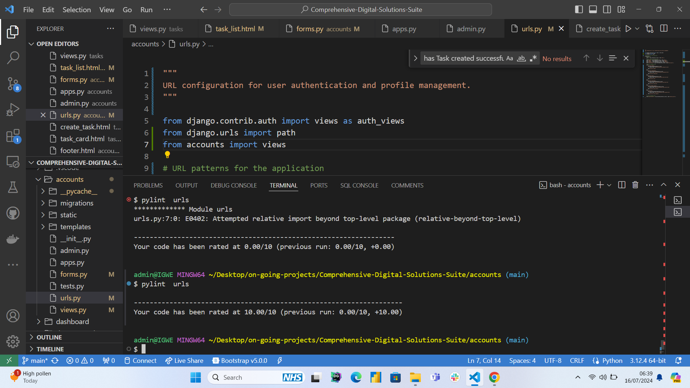

<a name="readme-top"></a>

<!-- PROJECT LOGO -->
<br />
<div align="center">

</div>
<br>
  <h1 align="center">TaskTopia</h1>
  <p align="center">Build your dream day, one task at a time.</p>

  <p align="center">
    TaskTopia is a context-aware, intelligent to-do list designed to help individuals and teams organize, track, and complete tasks efficiently. It offers a range of features including task prioritization, category management, notifications, reports, weather forecasting, and event logging. The platform is built with flexibility and scalability in mind, making it suitable for both personal use and organizational workflows.
    <br />
    <br />
    <a href="https://github.com/scientistigwe/tasktopia/blob/main/README.md"><strong>Explore the docs »</strong></a>
    <br />
    <br />

<!-- TABLE OF CONTENTS -->

Table of Contents

<!-- INTRODUCTION SECTION -->

  <details>
  <summary><a href="#introduction">SECTION 1: INTRODUCTION</a></summary>
        <li><a href="#about-the-project">About The Project</a>
        <li><a href='#ux'>User Experience (UX)</a></li>
        <li><a href='#user-stories'>User Stories</a></li>
        <li><a href="#technology-stack">Technology Stack</a></li>
        <li><a href="#languages-frameworks-libraries">Languages, Frameworks and Libraries</a></li>
        <li><a href="#management-and-development">Project Management and Development Approach</a></li>
    </details>
    <!-- PROJECT SETUP SECTION -->
    <details>
    <summary><a href="#project-setup">SECTION 2: PROJECT SETUP</a>
</summary>
        <li><a href="#prerequisites">Prerequisites</a></li>
        <li><a href="#installation">Installation</a></li>
    </details>
    <details>
    <summary><a href="#features-and-structure">SECTION 3: PROJECT FEATURES AND STRUCTURE</summary>
    <li><a href="#features">Features</a></li>
        <li><a href="#structure-and-navigation">Structure and Navigation</a></li>
        <li><a href="#wireframes">Wireframes</a></li>
         <li><a href="#design-and-styling">Design and Styling</a>
        <ol>
            <li><a href="#design">Design</a></li>
            <li><a href="#color">Color</a></li>
            <li><a href="#font">font</a></li>
            <li><a href="#media">media</a></li>
        </ol>
        </li>
</details>
<details>
<summary><a href="#testing-and-validation">SECTION 4: TESTING AND VALIDATION</a>
</summary>
    <li><a href="#testing">Testing</a></li>
        <li><a href="#validation">Validation</a>
        <ol>
        <li><a href="#html-validator-report">HTML Validator Report</a></li>
        <li><a href="#css-validator-report">CSS Validator Report</a></li>
        </ol>
        </li>
        <li><a href="#user-story-testing">User Story Testing</a></li>
        <li><a href="#bugs-and-issues">Bugs and Issues</a></li>
</details>
<details>
<summary><a href="#deployment-and-credits">SECTION 5: DEPLOYMENT AND CREDITS</a>
</summary>
        <li><a href="#final-product">Final Product</a></li>
        <li>
            <a href="#credits">Credits</a>
            <ol>
                <li><a href="#template">Template</a></li>
                <li><a href="#content">Content</a></li>
                <li><a href="#media2">Media</a></li>
            </ol>
        </li>
<li><a href="#acknowledgments">Acknowledgments</a></li>
<li><a href="#contact">Contact</a></li>
</details>

<!-- INTRODUCTION -->

#

<section>
<h1 id="introduction">SECTION 1: INTRODUCTION </h1>

<h2 id="about-the-project">About The Project</h2>

<p align="center"><a href="https://tasktopia-app-fbb446425a66.herokuapp.com/">TaskTopia</a>: a place to build your daily dreams, one task at a time</p>

<div align="center">

</div>

TaskTopia is a task management application designed to help users efficiently organize and track their tasks. The platform offers a user-friendly interface, robust features for task prioritization, and insights into productivity trends. Tasktopia aims to enhance productivity by providing detailed analytics and insights into task completion and prioritization.

<h2 id="ux">User Experience (UX)</h2>

The UX of TaskTopia focuses on simplicity and efficiency. Users can easily create, prioritize, and track tasks. The dashboard provides a comprehensive view of ongoing tasks, overdue tasks, and completed tasks. Detailed analytics offer insights into task distribution and productivity trends, helping users to manage their time effectively.

<h2 id="unique">Uniqueness of TaskTopia</h2>

- Automation:

  - Validation Messages: Automatically cleared after 5 seconds to ensure a clean and uncluttered user interface.

  - Task Categorization: Tasks are automatically categorized by status (done, in progress, completed) using due dates, start dates, and the current date.

- Dynamic Data Visualization: Utilizes charts and graphs to provide real-time insights into task completion rates, priority distribution, and productivity trends.

- Responsive Design: Ensures a seamless user experience across various devices, including desktops, tablets, and mobile phones.

- User Role Management: Different user roles (admin, manager, user) with specific permissions and access levels to maintain data security and integrity.

- Integrated Analytics: Provides detailed analytics and insights on task performance and user productivity, helping teams make informed decisions.

- Interactive Dashboards: Real-time updates and interactive elements like stacked bar charts and pie charts for visual representation of data.

- Robust CRUD Operations: Efficiently handles Create, Read, Update, and Delete operations for accounts, tasks, analytics, and reports, ensuring smooth data management.

- Enhanced User Experience (UX): Focused on providing an intuitive and user-friendly interface to maximize user satisfaction and efficiency.

You can view the deployed website [here](https://tasktopia-app-fbb446425a66.herokuapp.com/)

<h2 id="user-stories">User Stories</h2>

## Minimum Viable Product

- User Registration and Login

  - As a user, I want to register and log in securely to access my tasks.

  Acceptance Criteria:

  - User can create an account with a unique email and password.
  - User receives a confirmation email upon registration.
  - User can log in with their credentials.
  - User is redirected to their dashboard upon successful login.
  - Error messages are displayed for invalid login attempts.

- Task Creation

  - As a user, I want to create tasks with different priorities and due dates.

  Acceptance Criteria:

  - User can create a new task with a title, description, priority level (low, medium, high), and due date.
  - Task is added to the task list upon creation.
  - User receives a confirmation message upon successful task creation.
  - Task categorization by status is automated based on due date and current date.

- Task Tracking

  - As a user, I want to track the status of my tasks and receive notifications for overdue tasks.

  Acceptance Criteria:

  - Tasks are automatically categorized as "In Progress", "Completed", or "Overdue" based on start and due dates.
  - User can view the status of each task in the task list.
    User receives notifications for tasks that are overdue (future implementation).
  - Tasks are visually distinct based on their status (e.g., color-coded).

- Analytics and Insights

  - As a user, I want to view analytics on my task completion rates and productivity trends.

  Acceptance Criteria:

  - User can view a dashboard with charts and graphs showing task completion rates.
  - Productivity trends over time are displayed.
  - User can filter analytics by date range and task priority (future implementation).
  - Real-time updates on task analytics are provided.

- Task Editing and Deletion

  - As a user, I want to edit or delete my tasks to keep my task list up-to-date.

  Acceptance Criteria:

  - User can edit the details of a task (title, description, priority, start and due dates).
  - Changes are saved and reflected in the task list.
  - User can delete a task, and it is removed from the task list.
  - Confirmation messages are shown for successful edits and deletions.

- User Role Management

  - As an admin, I want to manage user roles and permissions to control access to different features.

  Acceptance Criteria:

  - Admin can assign roles (e.g., user, manager, admin) to different users.
  - Different roles have specific permissions and access levels.
  - Admin can view a list of all users and their roles.
  - Role changes are reflected immediately.

- User Profile Management

  - As a user, I want to manage my profile information to keep my account up-to-date.

  Acceptance Criteria:

  - User can update their profile information (name, email, password).
  - Changes are saved and reflected in the user profile.
  - User receives confirmation messages for successful updates.

## Future Implementation

- Notifications and Reminders

  - As a user, I want to receive reminders for upcoming tasks and notifications for important updates.

  Acceptance Criteria:

  - User receives email notifications for tasks due soon.
  - User is notified of any changes to their tasks.
  - Notifications can be customized in the user settings.

- Search and Filter Tasks

  - As a user, I want to search and filter my tasks to quickly find specific tasks.

  Acceptance Criteria:

  - User can search for tasks by title or description.
  - User can filter tasks by priority, status, and due date.
    Search results are displayed in real-time.
  - Filter options are easily accessible.

- Reports Generation

  - As a user, I want to generate reports on my tasks to review my performance and productivity.

  Acceptance Criteria:

  - User can generate reports showing completed tasks, pending tasks, and overdue tasks.
  - Reports can be filtered by date range, priority, and status.
  - User can download reports in PDF or CSV format.
  - Reports include charts and graphs for visual representation.

<h2 id="technology-stack">Technology Stack</h2>

<p>Tasktopia is built using a modern technology stack that ensures scalability, security, and a responsive user experience.</p>

<h2 id="languages-frameworks-libraries">Backend</h2>
<ul>
    <li>
    <a href="https://en.wikipedia.org/wiki/HTML5"> Python</a> - Core languge used in building the views/logic of the project.
    </li>
    <li>
        <a href="https://django.com"> Django</a> - Python full-battery fitted framework used in building the project. 
    </li>
    <li>
        <a href="https://www.django-rest-framework.org/"> Django REST API Framework</a> - Used to serve data to the dashboard. 
    </li>
</ul>

<h2 id="frontend">Frontend</h2>
<ul>
    <li>
        <a href="https://en.wikipedia.org/wiki/HTML5"> HTML5</a> - Used for designing the structure of the project.
    </li>
    <li>
        <a href="https://en.wikipedia.org/wiki/CSS"> CSS3</a> - Used for styling the project.
    </li>
    <li>
        <a href="[Bootstrap-url]"> Bootstrap</a> - Used for building responsive and mobile-first websites and web applications.
    </li>
    <li>
        <a href="[JQuery-url]"> jQuery</a> - Used for simplifying HTML document traversing, event handling, and animation.
    </li>
    <li>
        <a href="https://fonts.google.com/"> Google Fonts</a> - Provides all of the fonts for this website.
    </li>
    <li>
        <a href="https://fontawesome.com/"> Font Awesome</a> - Used for the site icons.
    </li>
    <li>
        <a href="https://en.wikipedia.org/wiki/JavaScript"> JavaScript</a> - Used for the hamburger navigation and icons.
    </li>
</ul>

<h2 id="database">Database</h2>
<ul>
    <li>
        <a href="https://en.wikipedia.org/wiki/JavaScript"> PostgreSQL</a> - pre-deployment test and production phase
    </li>
    <li>
        <a href="https://en.wikipedia.org/wiki/JavaScript"> SQLite3</a> - development and testing phase
    </li>
</ul>

<h2 id="hosting">Hosting</h2>
<ul>
    <li>
        <a href="https://heroku.com"> Heroku</a> - Used to deploy the project code.
    </li>
</ul>

<h2 id="version-control-and-agile-implementation">Version Control & Agile Implementation </h2>
<ul>
    <li>
        <a href="https://github.com/scientistigwe"> Github</a> - Used to store the project code.
    </li>
</ul>

<h2 id="wireframe-and-entity-relationship-diagram">Wireframe & Entity Relationship Diagram</h2>
<ul>
    <li>
        <a href="https://balsamiq.com/"> Balsamiq</a> - Used to create site wireframes.
    </li>
    <li>
        <a href="http://ami.responsivedesign.is/"> Am I Responsive</a> - Used to check if the site is responsive on different screen sizes.
    </li>
</ul>

<h2 id="code-quality-testing">Code Quality Testing</h2>
<ul>
    <li>
        <a href="https://www.freeformatter.com/html-formatter.html"> Free Online HTML Formatter</a> - Used to correct indentation issues and get rid of excess whitespace.
    </li>
        <li>
        <a href="https://balsamiq.com/"> W3S CSS Validator</a> - This was used to spot and handle errors and warnings in CSS files.
    </li>
        <li>
        <a href="https://balsamiq.com/"> W3S Markup Language (HTML) Validator</a> - This was used to spot and handle errors and warnings in HTML files.
    </li>
        <li>
        <a href="https://pylint.com/"> Pylint</a> - This was used to test and ensure that all python codes conform to minimum best practices.
    </li>
        <li>
        <a href="https://balsamiq.com/"> JsHint</a> - This wass used to test the quality and standards of javascript codes.
    </li>
        <li>
        <a href="https://saucelab.com/"> SauceLab</a> - This was used for cross broswer testing. 
    </li>
</ul>

<h2 id="management-and-development">Project Management and Development Approach</h2>

Tasktopia was developed using Agile methodology, focusing on continuous collaboration, flexibility, and delivering working software.

Customer collaboration was prioritized and this ensured that the project remained aligned with user needs, and features were prioritized effectively.

Adaptability was key allowing for iterative feedback and adjustments. This approach ensured that the project could evolve based on changing requirements.

Delivering functional software was emphasized over comprehensive documentation. The project focused on delivering functional increments in each sprint, promoting early feedback and continuous improvement.
Throughout the project, over **100** were made and (
[](https://github.com/scientistigwe/tasktopia/issues) + [](https://github.com/scientistigwe/tasktopia/issues) ) GitHub issues, adapting to changing requirements and feedback iteratively.

<div align="center">
**Kanban Board of Tasktopia**


</div>

<p align="right">(<a href="#readme-top">back to top</a>)</p>

<!-- PROJECT SETUP -->

#

<h1 id="project-setup">SECTION 2: PROJECT SETUP</h1>

<h2 id="prerequisites">Prerequisites</h2>
Python 3.8 or higher

<h2 id="installation">Installation</h2>

Below are the steps to install and set up the Tasktopia application. This template does not rely on any external dependencies or services.

1. Clone the repository:

   ```sh
   git clone https://github.com/scientistigwe/tasktopia.git

   ```

2. Navigate into the project directory:

   ```sh
   cd tasktopia
   ```

3. Create a virtual environment (optional but recommended):

   ```sh
   python -m venv env

   ```

4. Activate the virtual environment:

- On Windows:

  ```sh
  .\env\Scripts\activate

  ```

- On macOS and Linux

  ```sh
  source env/bin/activate

  ```

5. Install dependencies:

   ```sh
   pip install -r requirements.txt

   ```

6. Apply migrations:

   ```sh
   python manage.py migrate

   ```

7. Create a superuser (if needed):

   ```sh
   python manage.py createsuperuser

   ```

8. Start the development server:

   ```sh
   python manage.py runserver

   ```

9. Open your web browser and navigate to http://localhost:8000 to view the application.

<p align="right">(<a href="#readme-top">back to top</a>)</p>

#

<h1 id="features-and-structure">SECTION 3: PROJECT FEATURES AND STRUCTURE</h1>

This section encompasses the various elements and functionalities aimed at enhancing the user experience and achieving the goals of **Tasktopia** website. It outlines the key features and structural components intended to provide visitors with a seamless and informative journey through the platform.

<h1 id="features">Features</h1>

## Core Features

### Homepage Features

- **Introduction Section:** The homepage features an introductory section that explains the purpose and benefits of Tasktopia. This helps users quickly understand the value of the application and encourages them to explore further.
- **User-Friendly Navigation:** The homepage includes a navigation bar with links to key sections such as Home, Login, and Sign Up. This design ensures that users can easily access different parts of the application, enhancing the overall user experience.
- **Responsive Design:** The homepage is designed to be fully responsive, meaning it adjusts seamlessly to various screen sizes, from desktops to mobile devices. This ensures that users have a consistent and accessible experience regardless of the device they use.

<div align="center">
**Homepage**


</div>

### Account CRUD Operation

- **Create Account:** Users can create a new account by providing their details. This feature is essential for enabling personalized experiences and ensuring secure access to user-specific data.
- **Read Account Details:** Users can view their account details, which provides transparency and allows users to keep track of their information.
- **Update Account Information:** Users can update their account information, such as changing their password or updating their email address. This feature is crucial for maintaining up-to-date and accurate user data.
- **Delete Account:** Users have the option to delete their account if they no longer wish to use the service. This feature respects user autonomy and privacy, ensuring they have full control over their data.

<div align="center">
**Account CRUD**


</div>

### Task CRUD Operation

- **Create Task:** Users can create new tasks, specifying details such as title, description, start date, due date, and priority. This functionality is fundamental for effective task management.
- **Read Task:** Users can view the details of their tasks, enabling them to keep track of their tasks and deadlines.
- **Update Task:** Users can update task details, such as changing the due date or marking a task as completed. This feature is crucial for keeping task information current and relevant.
- **Delete Task:** Users can delete tasks that are no longer relevant, helping them keep their task list organized and clutter-free.

<div align="center">
**Task**


</div>

### Password Management

- **Password Reset:** Users can reset their passwords if they forget them by providing their email address. This ensures users can regain access to their accounts securely.
- **Password Change:** Users can change their passwords from their account settings to maintain account security.
- **Password Strength Indicator:** When creating or changing passwords, a strength indicator shows how secure the entered password is, encouraging users to create strong, secure passwords.

<div align="center">
**Password Management**


</div>

### Dashboard Metrics and Insights

#### KPI Cards

- **Total Tasks:** Displays the total number of tasks created by the user. This metric provides a quick overview of the user’s workload.
- **Overdue Tasks:** Shows the number of tasks that have passed their due date. This is crucial for highlighting tasks that need immediate attention.
- **Completed Tasks:** Indicates the number of tasks that have been completed. This metric helps users see their progress and accomplishments.

<div align="center">
**Analytics & Insights: KPI Cards**


</div>

#### Charts

- **Task Completion Rate Over Time Chart**

  - **Purpose:** Shows the task completion rate over time.
  - **Insight:** Monitors how the completion rate is changing, helping users understand trends and potentially identify factors that influence task completion.

- **Tasks Created vs. Tasks Completed Chart**

  - **Purpose:** Compares the number of tasks created versus completed.
  - **Insight:** Helps in understanding the balance between task creation and completion, providing insights into whether users are keeping up with their task load or falling behind.

- **Task Priority Distribution Chart**

  - **Purpose:** Displays the distribution of tasks by priority.
  - **Insight:** Helps in understanding how tasks are prioritized, which can inform users about where they need to focus their efforts.

<div align="center">
**Analytics & Insights: Charts Cards**


</div>

- **Category-wise Task Completion Table**

  - **Purpose:** Shows completion rates by category.
  - **Insight:** Helps identify categories with high or low completion rates, providing insights into areas that may need more attention or improvement.

<div align="center">
**Analytics & Insights: Table 1**


</div>

- **Overdue Task Table**

  - **Purpose:** Shows completion rates by category.
  - **Insight:** Helps identify users with overdue tasks, providing insights into areas that may need more attention or improvement and potential for auto messaging system which will serve as reminders to those users.

<div align="center">
**Analytics & Insights: Table 1**


</div>

### Future Implementations

- **Notification on Overdue Tasks:** Implement notifications to alert users when tasks are overdue. This feature will help users stay on top of their tasks and ensure important tasks are not overlooked.
- **Monthly Automated Report:** Generate and send automated monthly reports to users, summarizing their task activity, completion rates, and productivity trends. This feature will provide users with insights into their performance and areas for improvement.
- **Enhanced Collaboration Tools:** Introduce features for team collaboration, such as task assignment, shared task lists, and real-time updates. This will make Tasktopia more suitable for team and project management.
- **Integration with Calendar Apps:** Allow users to integrate their task lists with popular calendar applications like Google Calendar and Outlook. This will help users manage their schedules more effectively.
- **Mobile App Development:** Develop a mobile application for Tasktopia to provide users with a seamless and accessible task management experience on the go.

<p align="right">(<a href="#readme-top">back to top</a>)</p>

#

## Structure and Navigation

- **File Organization**

  - The files were structured into folders and clustered based on functionality. This approach ensures that related files are grouped together, making the project easier to navigate and maintain. The primary directories include:

    - **src/**: Contains all source code files, organized by components, services, and utilities.
    - **assets/**: Includes static assets such as images, icons, and fonts.
    - **styles/**: Houses global stylesheets and theme-related files.
    - **tests/**: Contains all testing files and configurations for unit, integration, and end-to-end tests.
    - **docs/**: Includes documentation files such as README, user guides, and API documentation.
    - **public/**: Contains public files like index.html which are served directly to the client.

  - **Naming Conventions**:
    - **JavaScript/TypeScript Files**: Named using camelCase or PascalCase to reflect their functionality, e.g., `userService.js`, `MainComponent.tsx`.
    - **Stylesheets**: Named using kebab-case to describe their purpose, e.g., `main-styles.css`, `header-theme.scss`.
    - **Image Files**: Named descriptively and often include size or purpose in the name, e.g., `logo-192x192.png`, `background-hero.jpg`.
    - **Configuration Files**: Use standard naming conventions like `webpack.config.js`, `babel.config.json`.

- **Directory Structure**:

  ```plaintext
  Tasktopia/
  ├── src/
  │   ├── components/
  │   │   ├── Header/
  │   │   │   ├── Header.js
  │   │   │   ├── Header.test.js
  │   │   │   └── Header.css
  │   │   ├── Footer/
  │   │   │   ├── Footer.js
  │   │   │   ├── Footer.test.js
  │   │   │   └── Footer.css
  │   ├── services/
  │   │   ├── apiService.js
  │   │   └── authService.js
  │   ├── utils/
  │   │   ├── helpers.js
  │   │   └── constants.js
  ├── assets/
  │   ├── images/
  │   │   ├── logo-192x192.png
  │   │   └── background-hero.jpg
  │   ├── icons/
  │   │   └── favicon.ico
  ├── styles/
  │   ├── main-styles.css
  │   ├── variables.scss
  ├── tests/
  │   ├── unit/
  │   │   └── example.test.js
  │   ├── integration/
  │   │   └── example.test.js
  ├── docs/
  │   ├── README.md
  │   └── API_DOCUMENTATION.md
  ├── public/
  │   ├── index.html
  │   └── manifest.json
  ├── .gitignore
  ├── package.json
  ├── webpack.config.js
  └── babel.config.json
  ```

  - **Navigation**:
    - The project follows a component-based architecture, making it easy to locate and modify individual components.
    - Centralized configuration files ensure that build and deployment processes are streamlined and easily manageable.
    - Documentation is accessible within the `docs/` directory, providing detailed information on the project's setup, usage, and API.
    - Tests are organized by type within the `tests/` directory, making it straightforward to run and manage different test suites.

This structure not only enhances maintainability and scalability but also ensures that new developers can quickly understand and contribute to the project.

<h2 id="wireframes">Wireframes</h2>

### _Home Page_

<p align="center">

</p>

### _Task_

<p align="center">

</p>

### _Dashboard_

<p align="center">

</p>

### _Account Management_

<p align="center">

</p>

### _Mobile View - Home Page_

<p align="center">

</p>

### \_Mobile View - Task

<p align="center">

</p>

### \_Mobile View - Dashboard

<p align="center">

</p>

### \_Mobile View - Account Management

<p align="center">

</p>

<h2 id="design-and-styling">Design and Styling</h2>

<h3 id="design">Design</h3>
<p>
    The design of Tasktopia is focused on providing a clean, intuitive user interface that facilitates efficient task management. The goal is to ensure that users can easily navigate the platform and manage their tasks without any distractions. The design principles are based on simplicity, readability, and accessibility, making use of modern web design standards.
</p>
<p>
    Below is a screenshot showcasing the responsive design of the Tasktopia homepage, demonstrating how it adapts seamlessly across different devices:
</p>


<h3 id="color">Color</h3>
<ul>
    <li><strong>Main background color - #f5f5f5 (White Smoke)</strong> - I chose this color because it provides a clean, neutral background that ensures good readability and reduces eye strain.</li>
    <li><strong>h1 headings and nav bar - #333333 (Dark Gray)</strong> - The dark gray color is used for h1 headings and the navigation bar to create a strong visual hierarchy and draw attention to the primary navigation elements.</li>
    <li><strong>h2 headings - #555555 (Medium Gray)</strong> - Medium gray is used for h2 headings to differentiate them from h1 headings while still maintaining a clear hierarchy.</li>
    <li><strong>Paragraph text - #666666 (Light Gray)</strong> - Light gray is used for paragraph text to ensure good readability without being too harsh on the eyes.</li>
    <li><strong>Footer - #333333 (Dark Gray)</strong> - The same dark gray as the navigation bar is used for the footer to maintain consistency and provide a strong foundation for the page.</li>
</ul>

<h3 id="font">Font</h3>
<ul>
    <li><strong>Main font:</strong> Open Sans</li>
    <li><strong>Secondary font:</strong> Roboto</li>
</ul>
<p>
    Open Sans is chosen as the main font for its clean, modern appearance and excellent readability across different devices and screen sizes. Roboto is used as the secondary font to provide a complementary style for headings and other emphasized text elements.
</p>

<h3 id="media">Media</h3>
<p>
    Tasktopia makes use of various media elements to enhance the user experience. Icons are used to represent different task categories and actions, providing visual cues that make the interface more intuitive. Images are optimized for fast loading times to ensure that the application remains responsive. Additionally, media queries are implemented to ensure that the design is fully responsive and works well on a variety of devices, from desktop computers to mobile phones.
</p>

# SECTION 4: TESTING AND VALIDATION

In this section, the functionalities of Tasktopia were thoroughly tested and validated to ensure alignment with user stories and technical standards.

## Testing

- **Cross Browser Compatibility Testing**
  I ensured compatibility with Chrome, Opera, Microsoft Edge, and Firefox desktop browsers and verified responsiveness using Chrome Developer Tools across various devices including:

  - Desktop
  - Laptop
  - Moto G4
  - Galaxy S5
  - iPhone 5/SE, iPhone 6/7/8, iPhone 6/7/8 Plus
  - iPad, iPad Pro
  - Galaxy Fold

<div align="center">

**Firefox**


</div>
<br>
<div align="center">

**Google Chrome**


</div>

**Test and Validation of Python code**

I utilized [](https://github.com/pylint-dev/pylint) to analyze Python code for potential errors, style violations, and best practices.

    ```bash
    pylint your_python_script.py
    ```

<div align="center">

<div align="center">

**Pylint - Account views.py, urls.py, and forms.py**

The following screenshots display the results of running Pylint on the `views.py`, `urls.py`, and `forms.py` files in the `accounts` app. Pylint is a static code analysis tool used to identify potential errors, enforce coding standards, and encourage best practices in Python code. By using Pylint, I can ensure the code is maintainable, adheres to coding standards, and minimizes bugs.





</div>

<div align="center">

**Pylint - Task app views.py, urls.py, models.py, and forms.py**

The following screenshots display the results of running Pylint on the `views.py`, `urls.py`, `models.py`, and `forms.py` files in the `tasks` app. This helps me maintain high code quality across various modules in the Task app, ensuring consistency and reliability.


</div>

<br>

**Test and Validation of JavaScript code**

To ensure the quality and adherence to coding standards of my JavaScript code, I used `jshint`. This tool helps detect errors and potential problems in the JavaScript codebase.


## Validation

For validation, I checked Tasktopia's codebase against industry standards and specifications.

**W3C HTML and CSS Validation**

I validated my HTML and CSS using W3C validation tools to ensure that the web pages adhere to web standards, which helps in maintaining compatibility and accessibility across different browsers and devices.


<br>

**Lighthouse Audit:**

I conducted Lighthouse audits to assess Tasktopia's performance, accessibility, best practices, and SEO. Lighthouse provides valuable insights and recommendations for improving web applications.


## App Testing

### Account app

For the Account app, I implemented various tests to ensure its functionality and reliability. Unit tests were created to test individual functions and methods, while integration tests were used to ensure that different parts of the app worked together seamlessly. I also performed end-to-end tests to simulate real user interactions and verify that the app behaves as expected in a production-like environment.

### Task app

In the Task app, I followed a similar approach. Unit tests were written to cover the core functionalities, such as task creation, updating, and deletion. Integration tests ensured that the interactions between different components, like views and models, were working correctly. End-to-end tests were crucial for validating the user workflows, ensuring that tasks could be managed smoothly from start to finish.

### Dashboard app

Testing the Dashboard app involved a comprehensive approach. I started with manual tests to verify the correctness of individual components, like data visualization widgets and summary statistics. Unit and Integration tests checked the communication between the frontend and backend, ensuring that data was accurately displayed. Finally, end-to-end tests were performed to validate the overall user experience, making sure that the dashboard provided an intuitive and responsive interface.

## Bugs and Issues

During the development process, I encountered several bugs and issues. Each issue was documented, and I took steps to correct them, often. For example, I faced a bug where the task creation form was not saving data correctly. After investigating, I discovered a missing field in the form validation process. By adding the missing field and writing additional tests, I was able to resolve the issue and prevent it from happening again. Main bug i encountered that took me over 12hours to resolve is `Server Error 500`. See details below.

### Summary of Error 500 Resolution

**Error Description:**
The Error 500 (Internal Server Error) occurred persistently when accessing the deployed application on Heroku. This error indicates an unexpected issue on the server side, preventing successful request completion.

**Likely Cause:**
The main cause of the Error 500 was related to the misconfiguration of static file serving in the Django application. Specifically, the application failed to locate and serve static files such as CSS, JavaScript, and image assets required for proper rendering of web pages.

**Steps Taken to Resolve:**

1. **Static Files Configuration:**

   - Updated `settings.py` to define correct paths for static files (`STATIC_URL`, `STATICFILES_DIRS`, `STATIC_ROOT`).
   - Ensured inclusion of all static file directories (`accounts/static`, `dashboard/static`, `tasks/static`) in `STATICFILES_DIRS`.

2. **Deployment Adjustments:**

   - Verified `STATIC_ROOT` setting to correctly collect static files for deployment (`BASE_DIR / 'staticfiles'`).
   - Adjusted deployment settings to ensure Heroku correctly served static files in its environment.

3. **Custom Error Handling:**

   - Created `500.html` template to display user-friendly error messages during Error 500 occurrences, improving user experience.
   - Implemented `error_views.py` for custom error handling within the Django application, enabling detailed error logging and debugging.

4. **Debugging and Logging:**

   - Implemented logging to capture static file serving errors and warnings during application runtime.
   - Utilized Heroku logs (`heroku logs --tail -a tasktopia-app`) to identify specific issues and monitor improvements after each configuration adjustment.

5. **Testing and Validation:**
   - Deployed the application multiple times to Heroku, systematically testing pages and functionalities to ensure correct static file serving.
   - Used browser developer tools and Heroku logs to confirm static file requests (`CSS`, `JavaScript`, `images`) returned `200` (OK) status codes.

**Resolution Outcome:**
By addressing static file configuration, implementing custom error handling with `500.html` and `error_views.py`, and ensuring correct deployment practices, the Error 500 was successfully resolved. The application now serves static files correctly, ensuring proper functionality and user experience.

**Conclusion:**
Correctly configuring static file handling and implementing robust error handling mechanisms are crucial for preventing and resolving Error 500 issues in Django applications. By following best practices and leveraging debugging tools effectively, such issues can be efficiently identified and resolved, ensuring a stable deployment environment.

<p align="right">(<a href="#readme-top">back to top</a>)</p>

#

<h2 id="deployment-and-credits">SECTION 5: DEPLOYMENT AND CREDITS</h2>

In this section, I will outline the process of deploying the tested and validated product, as well as acknowledge the external resources and inspirations utilized during this exercise.

<h2 id="final-product">Final Product</h2>

The product is live and can be seen on here: **[Live Preview](https://tasktopia-app-fbb446425a66.herokuapp.com/)**

### _Home Page_

<p align="center">

</p>

### _Signup_

<p align="center">

</p>

### _Login_

<p align="center">

</p>

### _Profile_

<p align="center">

</p>

### _Task Management Page_

<p align="center">

</p>

### _Analytics & Insights_

<p align="center">

</p>

<h2 id="deployment-process">Deployment Process</h2>

The deployment process for Tasktopia involved several steps to ensure that the application is running smoothly on a live server. Here's an overview of the steps I followed:

1. **Preparing the Environment:**

   - Ensured that all necessary dependencies were listed in the `requirements.txt` file.
   - Set up environment variables for sensitive information like database credentials and API keys.

2. **Choosing a Hosting Service:**
   - Selected [Heroku](https://www.heroku.com/) for deploying the application due to its ease of use and support for Python applications.
3. **Deploying the Application:**

   - Pushed the code to a GitHub repository.
   - Connected the GitHub repository to Heroku.
   - Configured the Heroku environment with necessary buildpacks and settings.
   - Deployed the application directly from the GitHub repository.

4. **Testing the Live Application:**
   - Conducted thorough testing on the live application to ensure all features were working as expected.
   - Fixed any issues that arose during the live testing phase.

### Deployment via Heroku

Deploying Tasktopia to Heroku was a straightforward and efficient process. Here’s a brief overview of the steps I followed:

1. **Create a Heroku Account:**

   - I signed up for a Heroku account at [Heroku's website](https://www.heroku.com/).

2. **Install Heroku CLI:**

   - I installed the Heroku Command Line Interface (CLI) on my local machine to manage the deployment process.

3. **Prepare the Application for Heroku:**

   - Added a `Procfile` to specify the commands Heroku should run to start the application.
   - Included `requirements.txt` and `runtime.txt` files to specify dependencies and the Python version.

4. **Deploy the Application:**

   - Logged into Heroku using the CLI: `heroku login`
   - Created a new Heroku app: `heroku create`
   - Pushed the code to Heroku: `git push heroku main`
   - Configured environment variables via the Heroku dashboard or CLI.

5. **Monitor and Manage:**
   - Used the Heroku dashboard to monitor the application’s performance and logs.
   - Made necessary adjustments to ensure the application runs smoothly on the live server.

<h2 id="credits">Credits</h2>

<h3 id="template">Template</h3>

- This template was adopted and adapted from README.md templates published by [Chibueze C. Igwe](https://github.com/scientistigwe/README-Template)

<h3 id="content">Content</h3>

- All content was written by **Chibueze C. Igwe**.

<h3 id="media2">Media</h3>

- All images used in the project were sourced from [Google Image Search](https://www.google.com).

<!-- ACKNOWLEDGMENTS -->
<h2 id="acknowledgments">Acknowledgments</h2>

I would like to extend my gratitude to the following resources that contributed significantly to the success of this project:

- [Choose an Open Source License](https://choosealicense.com)
- [GitHub Emoji Cheat Sheet](https://www.webpagefx.com/tools/emoji-cheat-sheet)
- [Malven's Flexbox Cheatsheet](https://flexbox.malven.co/)
- [Malven's Grid Cheatsheet](https://grid.malven.co/)
- [GitHub](https://pages.github.com)
- [Font Awesome](https://fontawesome.com)

<!-- CONTACT -->
<h2 id="contact">Contact</h2>

If you have any questions or feedback, feel free to reach out:

Project Link: [https://github.com/your_username/repo_name](https://github.com/your_username/repo_name)

<p align="right">(<a href="#readme-top">back to top</a>)</p>
</section>
